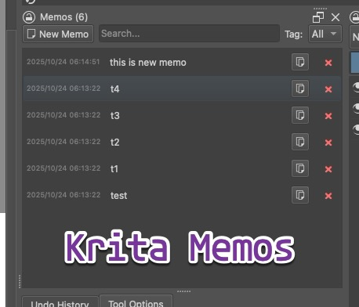

	

		
	

	<h1 align="center">Krita Memos</h1>
	<h4 align="center">A quick memo tool for Krita with auto-save, search, and hashtag filtering. </h4>

## Features

- **Quick actions**: Copy and delete buttons on each memo in the list
- **Visual tag editor**: Tag chips with autocomplete from existing tags
- **Search**: Search across all memo content and tags
- **Tag filtering**: Filter memos by hashtag
- **Timestamped**: Each memo shows last modified date/time
- **Per-document storage**: Memos saved in .kra file (no external database needed)

## Installation

### Using Krita's Built-in Importer (Recommended)

1. Download the latest `krita-memos-*.zip` from [Releases](https://github.com/YOUR_USERNAME/krita-memos/releases)
2. In Krita: **Tools** → **Scripts** → **Import Python Plugin...**
3. Select the downloaded ZIP file
4. When prompted, press **Yes** to enable the plugin
5. Restart Krita
6. Open the panel: **Settings** → **Dockers** → **Memos**

### Data Storage

Memos are saved in the .kra file using Krita's annotation API. This means:
- No external database needed
- Memos travel with your document
- Different documents have different memos
- Memos persist when you close and reopen documents

## Contributing

Issues and Pull Requests are welcome.

## License

GPL-3.0-or-later

## Resources

- [Krita Official Website](https://krita.org/)
- [Krita API Documentation](https://api.kde.org/krita/html/)
- [Krita Artists Forum](https://krita-artists.org/)
